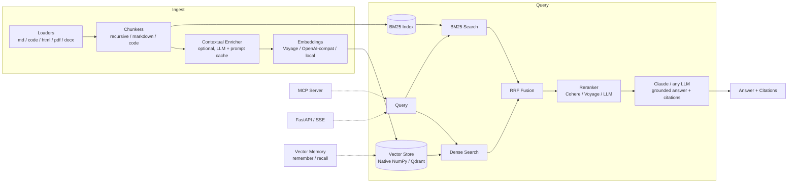

<div align="center">

# 🔥 Ragnite

**Production-grade Retrieval-Augmented Generation — hybrid search, contextual retrieval, citations, vector memory, and an MCP server. Batteries included.**

[](https://github.com/sunamebr/Ragnite/actions/workflows/ci.yml)
[](https://www.python.org)
[](LICENSE)
[](https://github.com/astral-sh/ruff)

</div>

---

Most RAG stacks are a demo that falls apart in production: dense-only retrieval that misses exact terms, no citations, no eval loop, a hard dependency on one vendor. Ragnite is the opposite — a small, typed, async core built around the techniques that actually move retrieval quality, with clean seams for every provider.

## Why Ragnite

| | |
|---|---|
| 🔎 **Hybrid retrieval by default** | Dense embeddings + built-in BM25, fused with Reciprocal Rank Fusion. Lexical recall for identifiers and names, semantic recall for paraphrases. |
| 🧠 **Contextual retrieval** | Optional LLM-written context per chunk (the Anthropic technique), with prompt caching — dramatically fewer retrieval misses on ambiguous chunks. |
| 🎯 **Reranking** | Cohere, Voyage, or listwise LLM reranking as a second precision stage. |
| 📌 **Citations, always** | Answers are grounded in numbered sources and return structured `Citation` objects — verifiable by construction. |
| 💾 **Vector memory** | `remember()` / `recall()` persistent semantic memory — give any agent long-term memory. |
| 🔌 **MCP server** | One command exposes search, ask, ingest and memory to Claude Code, Claude Desktop, or any MCP host. |
| 📈 **Evaluation built in** | hit@k, MRR, nDCG plus LLM-judge faithfulness and relevancy. Measure before you ship. |
| 🧱 **Zero-config to global scale** | Runs offline with BM25 + native NumPy store; flips to Qdrant + Docker + API auth for production. Every provider is swappable. |
| ⚡ **Async-first, fully typed** | pydantic v2 models end to end; streaming (SSE) answers; SQLite embedding cache so re-ingestion is free. |

## Install

```bash
pip install ragnite                      # core (BM25 + native store, zero config)
pip install "ragnite[anthropic]"         # + Claude answers
pip install "ragnite[all]"               # + server, MCP, Qdrant, PDF/DOCX loaders
```

## Quickstart

**60 seconds, no API keys** — keyword search over your files:

```bash
ragnite ingest ./docs
ragnite query "how does billing work?"
```

**Full pipeline** — semantic + keyword retrieval, grounded streaming answers:

```bash
export VOYAGE_API_KEY=...        # embeddings (recommended with Claude)
export ANTHROPIC_API_KEY=...     # generation

ragnite ingest ./docs
ragnite ask "how does billing work?"
```

**As a library:**

```python
import asyncio
from ragnite import build_engine

async def main():
    engine = build_engine()                      # wired from env vars
    await engine.ingest_path("./docs")

    answer = await engine.ask("How does billing work?")
    print(answer.text)
    for c in answer.citations:
        print(f"[{c.marker}] {c.source}")

asyncio.run(main())
```

Or compose it explicitly — every piece is injectable:

```python
from ragnite import RagEngine, NativeVectorStore, VoyageEmbedder, LLMReranker
from ragnite.llm import AnthropicChat

llm = AnthropicChat(model="claude-opus-4-8")
engine = RagEngine(
    store=NativeVectorStore(".ragnite/collections/default"),
    embedder=VoyageEmbedder(),
    llm=llm,
    reranker=LLMReranker(llm),
    contextual=True,                 # Anthropic-style contextual retrieval
)
```

## Architecture



## MCP — plug Ragnite into Claude

```bash
pip install "ragnite[mcp,anthropic]"
claude mcp add ragnite -- ragnite mcp        # Claude Code
```

Claude Desktop (`claude_desktop_config.json`):

```json
{
  "mcpServers": {
    "ragnite": {
      "command": "ragnite",
      "args": ["mcp"],
      "env": { "VOYAGE_API_KEY": "...", "ANTHROPIC_API_KEY": "..." }
    }
  }
}
```

Tools exposed: `search`, `ask`, `ingest_text`, `ingest_path`, `remember`, `recall`, `stats`. The memory tools give your agent **persistent vector memory across sessions**.

## HTTP API

```bash
pip install "ragnite[server]"
ragnite serve --port 8000
```

| Method | Route | Description |
|---|---|---|
| `GET` | `/healthz` | Liveness probe |
| `GET` | `/v1/stats` | Index statistics |
| `POST` | `/v1/ingest` | `{"documents": [{"text", "source?", "metadata?"}]}` |
| `POST` | `/v1/search` | `{"query", "top_k?", "filters?"}` → scored chunks |
| `POST` | `/v1/ask` | `{"query", "stream?": true}` → answer + citations (SSE when streaming) |

Set `RAGNITE_API_KEY` to require `Authorization: Bearer <key>`.

## Evaluation

Create `eval.jsonl`:

```json
{"query": "Why is Mars red?", "relevant_ids": ["doc_mars"]}
{"query": "largest planet", "relevant_ids": ["doc_jupiter"]}
```

```bash
ragnite eval eval.jsonl              # hit@k, MRR, nDCG
ragnite eval eval.jsonl --judge      # + LLM-judge faithfulness & relevancy
```

Wire it into CI and treat retrieval quality like a test suite.

## Configuration

Everything via env vars (or `.env` — see [.env.example](.env.example)):

| Variable | Default | Notes |
|---|---|---|
| `RAGNITE_EMBEDDER` | `auto` | `voyage` \| `openai` \| `local` \| `fake` \| `none`; auto-detects by API key |
| `RAGNITE_LLM` | `auto` | `anthropic` \| `openai` \| `none` |
| `RAGNITE_LLM_MODEL` | `claude-opus-4-8` | any Claude / OpenAI-compatible model |
| `RAGNITE_STORE` | `native` | `qdrant` for scale-out |
| `RAGNITE_RERANKER` | `none` | `cohere` \| `voyage` \| `llm` |
| `RAGNITE_CONTEXTUAL` | `0` | `1` enables contextual retrieval at ingest |
| `RAGNITE_CHUNK_SIZE` / `_OVERLAP` | `1600` / `200` | characters |
| `RAGNITE_DATA_DIR` | `.ragnite` | store, embedding cache, memory |
| `OPENAI_BASE_URL` | — | point at Ollama / vLLM / Groq for local & OSS models |

## Scaling up

```bash
cd docker && docker compose up --build
```

Ships the Ragnite API + Qdrant with persistent volumes. The native store handles hundreds of thousands of chunks on a single node (exact search, NumPy); switch `RAGNITE_STORE=qdrant` when you need sharding, replication, or multi-node scale. The embedding cache makes re-indexing idempotent and cheap; stateless API nodes scale horizontally behind a load balancer.

## Project layout

```
src/ragnite/
├── ingest/      loaders + chunkers (recursive, markdown-aware, code-aware)
├── embed/       Voyage, OpenAI-compat, local, fake + SQLite cache
├── store/       native NumPy store, Qdrant adapter
├── retrieve/    BM25, RRF fusion, rerankers, retriever orchestration
├── llm/         Anthropic (official SDK), OpenAI-compatible
├── rag/         engine, prompts, contextual retrieval, memory
├── eval/        IR metrics + LLM-judge
├── server/      FastAPI app + MCP server
└── cli.py       ragnite ingest | query | ask | serve | mcp | eval
```

## Roadmap

- [ ] pgvector, Milvus and Weaviate store adapters
- [ ] GraphRAG-style entity/community indexing
- [ ] Multi-query expansion + HyDE in the retriever
- [ ] Parent-document / small-to-big retrieval
- [ ] Multi-tenant collections + per-tenant auth in the server
- [ ] Async ingestion workers (queue-based) for very large corpora
- [ ] OpenTelemetry tracing

## Contributing

PRs welcome — see [CONTRIBUTING.md](CONTRIBUTING.md). The test suite runs fully offline (`uv sync --group dev && uv run pytest`).

## License

[MIT](LICENSE) © sunamebr
