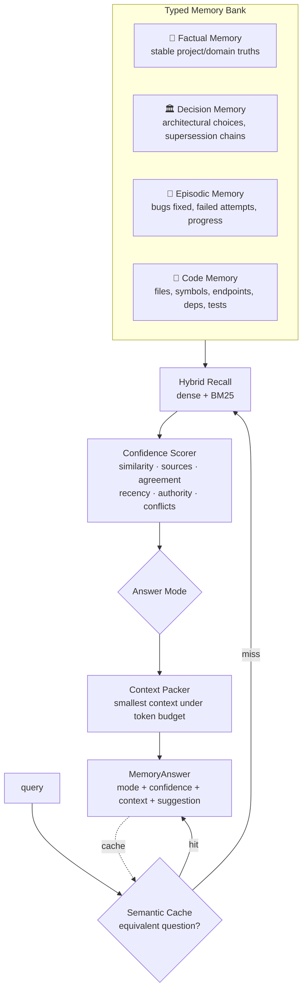

<div align="center">

# 🔥 Ragnite

**Confidence-Aware RAG Memory Engine for LLMs and coding agents.**

Typed memory · confidence scoring · answer modes · token-budgeted context packing · semantic cache · hybrid retrieval · MCP server

[](https://github.com/sunamebr/Ragnite/actions/workflows/ci.yml)
[](https://www.python.org)
[](LICENSE)
[](https://github.com/astral-sh/ruff)

**Ragnite makes Claude Code remember before it reasons again.**

</div>

---

## TL;DR — 30 seconds

```bash
pip install "ragnite[mcp]"
cd your-project
ragnite claude install     # wires /ragnite skill + MCP + hooks (merge-safe)
# inside Claude Code:
/ragnite init              # one-time: index code + docs, seed project memory
/ragnite invoke            # activate live context injection — then just work
```

Every prompt now arrives with the smallest sufficient project memory and an explicit confidence verdict (`direct` / `cautious` / `ask_clarification` / `search_more` / `refuse_guess`). The agent stops re-reading the repo; what it learns gets written back. Limits & risks: [docs/security.md](docs/security.md) and "[What Ragnite is not](#what-ragnite-is-not)".

## The problem

Every session, your coding agent re-reads the repo. Re-derives the architecture. Re-discovers that the deploy runs on Fridays, that you chose gRPC over REST six months ago, that the flaky auth test was fixed by freezing the clock. **Tokens burned re-analyzing what should already be consolidated** — and worse, the agent answers with the same false confidence whether it knows or guesses.

Ragnite is the missing layer: a **memory and conviction engine**. Agents write consolidated knowledge once; on every question, one `recall()` returns the *smallest sufficient context* plus an explicit verdict on how much to trust it.

```python
from ragnite import build_memory_engine

memory = build_memory_engine()

await memory.remember_decision("Services communicate over gRPC.", subject="api-style")
await memory.remember_fact("The database listens on port 5432.", subject="db-port")
await memory.remember_episode("Fixed flaky auth test by freezing the clock.")
await memory.index_repo(".")          # Code Memory: files, symbols, endpoints, deps

answer = await memory.recall("how do services talk to each other?")
answer.mode        # "direct" — strong consolidated evidence
answer.confidence  # 0.86
answer.context     # token-budgeted evidence pack, ready to inject
answer.suggestion  # "Answer directly from the provided context — do not re-analyze."
```

## Architecture



### Answer modes — the conviction contract

| Mode | Meaning | What the agent should do |
|---|---|---|
| `direct` | Strong consolidated evidence | Answer from context; **do not re-analyze** |
| `cautious` | Partial evidence | Answer with explicit caveats and attribution |
| `ask_clarification` | Conflicting/ambiguous memory entries | Ask the user one targeted question |
| `search_more` | Weak evidence | Retrieve more (code search, docs, web) first |
| `refuse_guess` | No reliable basis | Say "I don't know" instead of hallucinating |

### Confidence Scorer

Confidence blends seven signals — **top similarity, mean similarity, source count, dense↔keyword agreement, recency (per-kind half-life), source authority, conflict detection** — and is hard-capped by relevance: fresh, authoritative sources can never make a weak match look trustworthy. Conflicts (two active entries claiming the same `subject`) force `ask_clarification` until a decision supersedes the loser.

### Context Packer

Greedy value-ordered packing under a token budget (default 2000), near-duplicate suppression, compact one-line headers with kind/similarity/age/provenance. The LLM gets evidence, not prose.

### Semantic caching — two caches, two honest promises

- **Verdict cache** (on by default for `recall`): an equivalent question returns the previous packed context + verdict — **zero retrieval, zero scoring, zero packing**. The host still spends LLM tokens if it forwards that context to a model.
- **AnswerCache** (opt-in, `RAGNITE_ANSWER_CACHE=1`, for document-RAG `ask`): caches the **finished generated answer** — a hit is **genuinely zero LLM tokens** (`answer.cached == True`, no model call). Stricter threshold (0.93) and shorter TTL (3d), because serving a wrong final answer is worse than recomputing.

Both are TTL-bounded and invalidated on writes (memory writes clear the verdict cache; ingestion clears the answer cache). Full contract: [docs/semantic-cache.md](docs/semantic-cache.md).

### Code Memory

`index_repo()` parses the repository into memory: Python via AST (functions, classes, methods, docstrings, imports, FastAPI/Flask-style routes), other languages via definition-boundary extraction. Incremental — unchanged files are hash-skipped, deleted files evicted. "Where is auth handled?" becomes one recall instead of a directory crawl.

## Plug it into Claude Code

**Invoke Mode** — the full experience: one installer wires the `/ragnite` skill, the MCP server, and session hooks for **event-driven live context injection**. After that you just work; Ragnite injects memory before prompts, learns from tool calls, and re-indexes files you edit.

```bash
pip install "ragnite[mcp]"
ragnite claude install     # skill + MCP + hooks + config (merges, never clobbers)
# inside Claude Code:
#   /ragnite init          heavy bootstrap: index code+docs, seed memories, smoke recall
#   /ragnite invoke        activate live context injection
#   /ragnite pause|status  control & inspect
```

| Session event | What Ragnite does |
|---|---|
| SessionStart | injects the project briefing (brief, active decisions, constraints) |
| UserPromptSubmit | recalls against the prompt → injects a `ragnite-context` block (mode, confidence, evidence) |
| PostToolUse (Edit/Write) | incrementally re-indexes the changed file, invalidates the cache |
| PostToolUse (Bash) | learns candidate episodes from test runs and failing commands |
| SessionStart (compact) | captures the compaction summary as a candidate episode, re-grounds |

Default mode never blocks tools; opt-in `strict = true` denies broad Grep/Glob searches that memory already answers `direct`. Secrets are redacted before anything is stored; `.env*`, keys and `.ragniteignore` paths are never ingested. Details: [docs/claude-code.md](docs/claude-code.md), [docs/invoke-mode.md](docs/invoke-mode.md), [docs/security.md](docs/security.md).

**MCP only** (any MCP host, no hooks):

```bash
pip install "ragnite[mcp,anthropic]"
claude mcp add ragnite -- ragnite mcp
```

Tools exposed: `recall` (verdict + packed context), `remember`, `remember_decision` (with supersession), `index_repo`, `forget`, plus document RAG (`search`, `ask`, `ingest_*`) and `stats`. Claude Desktop config:

```json
{
  "mcpServers": {
    "ragnite": {
      "command": "ragnite",
      "args": ["mcp"],
      "env": { "VOYAGE_API_KEY": "...", "ANTHROPIC_API_KEY": "..." }
    }
  }
}
```

The intended agent loop: **`recall` before re-reading anything; obey the mode; `remember` whatever was expensive to figure out.** ([docs/agent-loop.md](docs/agent-loop.md) has the system-prompt snippet.)

### A Claude Code session, before/after

```
user: "Where do we validate JWTs, and which algorithm?"

WITHOUT Ragnite                          WITH Ragnite
─ Glob src/**/auth*                      ─ recall("where are JWTs validated...")
─ Read src/auth/jwt.py      (~2k tok)      -> mode: direct (0.83), ~60-token context:
─ Read src/auth/middleware  (~3k tok)         - [code|sim 0.78|2d|src/auth/jwt.py:41]
─ Grep "RS256|HS256"                            verify_token: validates RS256 JWTs...
─ Read adr/009.md           (~1k tok)         - [decision|sim 0.71|4mo|adr/009.md]
─ answer                                        jwt-alg: RS256; HS256 forbidden.
                                          ─ answer directly, zero file reads
≈ 6,000+ input tokens, every session     ≈ tens of tokens after the first session
```

The right-hand math is an estimate that scales with your repo, not a guarantee — but the mechanism is exact: `direct` mode means the agent is told *not* to re-read sources, and the packed context replaces them. After the session, the agent writes back what it learned (`remember_decision(..., supersedes=...)`), making the next session cheaper still.

## Install & quickstart

```bash
pip install ragnite                  # core — runs offline (BM25 + native store)
pip install "ragnite[all]"           # + Claude, server, MCP, Qdrant, PDF/DOCX
```

```bash
# memory & conviction
ragnite index-code .
ragnite remember "We deploy Fridays at noon" --kind decision --subject deploy-window
ragnite recall "when do we deploy?"
#  mode: direct  confidence: 0.84  tokens: 31
#  - [decision|sim 0.79|today] deploy-window: We deploy Fridays at noon

# document RAG (grounded answers with [n] citations)
ragnite ingest ./docs
ragnite ask "how does billing work?"
```

Embeddings: Voyage AI (recommended with Claude), any OpenAI-compatible endpoint (OpenAI, Ollama, vLLM, Jina), or local sentence-transformers. Generation: Claude via the official SDK (default `claude-opus-4-8`) or OpenAI-compatible. **No keys at all? Everything still works on BM25.**

## Document RAG (the second half)

The classic pipeline is still here and production-grade: loaders (md/code/html/json/pdf/docx) → recursive/markdown/code-aware chunking → optional **contextual retrieval** (Anthropic technique, prompt-cached) → hybrid dense+BM25 with **RRF fusion** → optional reranking (Cohere/Voyage/LLM listwise) → **grounded answers with structured citations**, sync or SSE streaming.

```python
from ragnite import build_engine

engine = build_engine()
await engine.ingest_path("./docs")
result = await engine.ask("How does billing work?")   # result.citations -> [Citation(...)]
```

## HTTP API

```bash
pip install "ragnite[server]" && ragnite serve
```

| Method | Route | Description |
|---|---|---|
| `POST` | `/v1/memory/recall` | `{"query"}` → mode + confidence + packed context |
| `POST` | `/v1/memory/remember` | `{"text", "kind", "subject?", "supersedes?"}` |
| `POST` | `/v1/memory/index_code` | `{"path"}` → incremental code indexing |
| `GET` | `/v1/memory/stats` | records by kind, cache entries, policy |
| `POST` | `/v1/ingest` / `/v1/search` / `/v1/ask` | document RAG (SSE on `stream: true`) |
| `GET` | `/healthz` / `/v1/stats` | ops |

Set `RAGNITE_API_KEY` for bearer auth.

## Who is this for

Coding agents (Claude Code, autonomous loops) · LLM assistants · MCP servers · living documentation · project memory · semantic search · engineering teams that want decisions and tribal knowledge queryable with a confidence score.

## What Ragnite is not

- **Not a chatbot or an agent.** It never decides for the agent — it returns evidence plus a verdict; the host model does the talking.
- **Not a vector database.** It *uses* one (built-in native store or Qdrant); the product is the memory typing, confidence and packing on top.
- **Not magic grounding.** Confidence is computed from retrieval signals, not from verifying truth — garbage memories in, confidently-scored garbage out. Use `subject` keys and supersession to keep memory curated.
- **Not an LSP or code-intelligence engine.** Code Memory indexes structure (symbols, routes, imports) for retrieval; it doesn't resolve types or call graphs.

## When not to use Ragnite

- One-shot scripts or stateless workloads — there is nothing to remember across runs.
- Corpora that change wholesale on every query (live news feeds): caches and memory consolidate stability; total churn defeats both.
- Sub-100k-token projects an agent can just read whole — memory overhead may not pay for itself until the project or session count grows.
- Hard-realtime answers about data of record — query the system of record, don't recall a memory of it.

## Configuration

| Variable | Default | Notes |
|---|---|---|
| `RAGNITE_EMBEDDER` | `auto` | `voyage` \| `openai` \| `local` \| `fake` \| `none` (auto-detects by key) |
| `RAGNITE_LLM` / `RAGNITE_LLM_MODEL` | `auto` / `claude-opus-4-8` | `anthropic` \| `openai` \| `none` |
| `RAGNITE_STORE` | `native` | `qdrant` for scale-out (docs **and** memory bank) |
| `RAGNITE_MEMORY_BUDGET` | `2000` | context-packer token budget |
| `RAGNITE_CACHE_THRESHOLD` / `_TTL_DAYS` | `0.90` / `7` | verdict cache similarity & freshness |
| `RAGNITE_ANSWER_CACHE` | `0` | `1` = cache final generated answers (zero-LLM-token hits) |
| `RAGNITE_RERANKER` | `none` | `cohere` \| `voyage` \| `llm` |
| `RAGNITE_CONTEXTUAL` | `0` | contextual retrieval at ingest |
| `RAGNITE_DATA_DIR` | `.ragnite` | bank, semcache, doc collections, embedding cache |

Full list in [.env.example](.env.example). Confidence thresholds/weights are code-level: `ConfidencePolicy(direct_threshold=..., w_recency=...)`.

## Scaling

Native NumPy store (exact cosine, persisted) handles hundreds of thousands of records with zero infra; `RAGNITE_STORE=qdrant` moves both document collections and the memory bank to Qdrant for sharding/HA. `docker compose up` in [docker/](docker) ships API + Qdrant. Embedding cache (SQLite) makes re-indexing free; eval suite (`ragnite eval`, hit@k/MRR/nDCG + LLM-judge) keeps retrieval quality regression-tested in CI.

## Benchmarks

`uv run python benchmarks/bench.py` — fully offline (deterministic embedder), so the numbers measure engine overhead, not provider latency. On a laptop:

```
cold recall over 300 facts                     0.50 ms
cached recall (verdict cache)                  0.04 ms   (11.8x)
packed context reused per hit                  ~308 tokens
code indexing (47 files / 298 symbols)         0.14 s
incremental re-index (47 unchanged)            0.01 s
retrieval quality fixture (hit@3)              1.00
```

With a real provider, cold recall adds one embedding API round-trip; cached recall still skips retrieval+scoring, and an AnswerCache hit also skips the LLM call.

## Documentation

| Doc | Covers |
|---|---|
| [docs/claude-code.md](docs/claude-code.md) | Invoke Mode for Claude Code: install, /ragnite commands, troubleshooting |
| [docs/invoke-mode.md](docs/invoke-mode.md) | Event-driven live context injection — lifecycle and per-event behavior |
| [docs/hooks.md](docs/hooks.md) | Exact hook event mapping and I/O contracts |
| [docs/security.md](docs/security.md) | What is never stored, redaction patterns, operational boundaries |
| [docs/agent-loop.md](docs/agent-loop.md) | The four-habit agent contract, system-prompt snippet, worked session |
| [docs/confidence-policy.md](docs/confidence-policy.md) | Signals, formula, thresholds, tuning recipes, known limits |
| [docs/semantic-cache.md](docs/semantic-cache.md) | Verdict cache vs AnswerCache — exact promises and invalidation |
| [docs/code-memory.md](docs/code-memory.md) | What's extracted per language, incremental semantics, limits |
| [docs/memory.md](docs/memory.md) | Memory taxonomy, supersession, recall pipeline overview |
| [docs/architecture.md](docs/architecture.md) / [docs/deployment.md](docs/deployment.md) | Document-RAG pipeline · production checklist |

## Project layout

```
src/ragnite/
├── memory/      ★ the conviction layer
│   ├── bank.py        typed memory bank (fact/decision/episode/code)
│   ├── scorer.py      confidence signals + answer-mode policy
│   ├── packer.py      token-budgeted context assembly
│   ├── semcache.py    semantic answer cache
│   ├── code_index.py  incremental repository indexing
│   └── engine.py      MemoryEngine.recall() -> MemoryAnswer
├── ingest/      loaders + chunkers
├── embed/       Voyage / OpenAI-compat / local / fake + SQLite cache
├── store/       native NumPy store, Qdrant adapter
├── retrieve/    BM25, RRF fusion, rerankers
├── llm/         Anthropic (official SDK), OpenAI-compatible
├── rag/         document RAG engine, contextual retrieval, prompts
├── eval/        IR metrics + LLM-judge
└── server/      FastAPI + MCP
```

## Roadmap

- [ ] Auto-consolidation: distill episodes into facts/decisions on a schedule
- [ ] LLM-assisted conflict resolution and memory dedup
- [ ] Memory decay & promotion policies (episode → fact)
- [ ] pgvector / Milvus store adapters; GraphRAG-style entity linking
- [ ] Multi-tenant memory banks with per-tenant auth
- [ ] OpenTelemetry tracing; token-savings analytics per agent

## Contributing & license

PRs welcome — [CONTRIBUTING.md](CONTRIBUTING.md). Test suite runs fully offline: `uv sync --group dev && uv run pytest`. [MIT](LICENSE) © sunamebr
